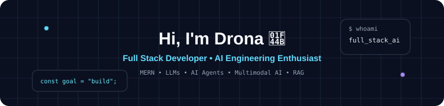

  

  

  
  
  
  
  
  

---

# Hi, I'm Drona 👋

### B.Tech CSE Graduate | MERN Stack Developer | AI Engineering Enthusiast

I'm a Computer Science graduate interested in building **full-stack applications and AI-powered systems**.

I started with web development and the MERN stack, building applications around practical problems. I'm now expanding into **AI Engineering, Generative AI, LLM applications, multimodal AI, and AI agents**.

My goal is to combine strong full-stack development with AI to build useful, production-oriented applications.

---

## 🚀 Featured Projects

### 🛒 AgriMart

A MERN-based agricultural marketplace designed to connect farmers, suppliers, and consumers.

**Highlights**

- Farmer, Supplier, Consumer, and Admin roles
- JWT authentication and role-based access
- Razorpay payment integration
- Multilingual support across 6 languages
- Admin verification and audit logging

**Tech:** `React.js` `Node.js` `Express.js` `MongoDB` `Mongoose` `JWT`

[🔗 View AgriMart](https://github.com/Drona0113/AgriMart)

---

### 🎨 MangaCraft

An **AI Manga Panel Assistant** designed to help aspiring manga artists work with their panels and creative projects.

The project evolved from a conversational AI assistant into an AI agent capable of working with project context, memories, manga panels, multimodal inputs, and generated references.

**V1 — Conversational AI**

- LLM-powered chat
- Conversation history
- System prompting
- Gradio interface

**V2 — AI Agent + Project Intelligence**

- LLM tool calling
- Project Memory
- Asset Memory
- Panel analysis
- Composition analysis
- Multimodal understanding
- AI-generated references
- Multiple conversations per project
- SQLite persistence
- Project-specific context

**Tech:** `Python` `Gradio` `SQLite` `LLM APIs` `OpenRouter` `Hugging Face`

[🔗 View MangaCraft](https://github.com/Drona0113/Manga-Craft)

---

### 🏘️ Grama Charithra

A MERN application focused on documenting and exploring the **history and cultural heritage of villages in Andhra Pradesh**.

**Highlights**

- Authentication and role-based access
- Village management
- Search and filtering
- Reviews and ratings
- Maps and location-based information

**Tech:** `React.js` `Node.js` `Express.js` `MongoDB` `Mongoose`

[🔗 View Grama Charithra](https://github.com/Drona0113/Gramacharitra-dyamic)

---

### 📊 Crime Count Prediction

A machine-learning project using **Support Vector Regression (SVR)** to predict crime counts in India and visualize the results.

**Tech:** `Python` `Machine Learning` `SVR` `Data Visualization`

[🔗 View Project](https://github.com/Drona0113/Crime-Count-Prediction-using-SVR)

---

## 🛠️ Tech Stack

### Languages

`JavaScript` `Python` `Java`

### Frontend

`HTML` `CSS` `React.js` `Redux Toolkit`

### Backend & Databases

`Node.js` `Express.js` `MongoDB` `Mongoose` `SQLite` `REST APIs`

### AI & Generative AI

`LLMs` `Generative AI` `AI Agents` `Tool Calling` `Multimodal AI` `Prompt Engineering`

### Tools

`Git` `GitHub` `VS Code` `Postman`

---

## 🧠 DSA

Currently practicing **Data Structures & Algorithms in Java** using the **Striver A2Z DSA Course / Sheet by Take U Forward**.

---

## 📚 Currently Learning

I'm expanding my knowledge toward **AI Engineering and production full-stack development**.

- Data Structures & Algorithms in Java — Striver A2Z
- Python and its libraries
- AI Engineering
- LLM application development
- Generative AI
- AI Agents
- RAG
- Embeddings & Vector Databases
- Production backend architecture

---

## 🎯 Career Focus

I'm currently looking for **early-career software development opportunities**, particularly in:

`MERN Stack` · `Full-Stack Development` · `React` · `Node.js` · `Software Development`

At the same time, I'm building toward a long-term career in **AI Engineering**, combining full-stack development with AI systems.

---

## ⚡ Currently Building

### MangaCraft V2 → V3

Taking MangaCraft from its V2 AI-agent foundation toward a **production-oriented full-stack AI application**.

The next stage will explore:

`React` · `FastAPI` · `PostgreSQL` · `Authentication` · `RAG` · `Embeddings` · `Vector Search` · `Multi-user Architecture`

---

## 📊 GitHub Activity

  <picture>
    <source
      media="(prefers-color-scheme: dark)"
      srcset="./dist/github-snake-dark.svg"
    />
    <source
      media="(prefers-color-scheme: light)"
      srcset="./dist/github-snake.svg"
    />
    
  </picture>

---

## 🤝 Let's Connect

I'm interested in connecting with developers, engineers, and people building interesting products with web technologies and AI.

- 💼 LinkedIn: [kaja-drona-venkata-sai-gopinadh](https://www.linkedin.com/in/kaja-drona-venkata-sai-gopinadh-443986269/)
- 📧 Email: `drona8978@gmail.com`
- 💻 GitHub: [@Drona0113](https://github.com/Drona0113)

---

  <i>Building. Learning. Shipping. 🚀</i>

