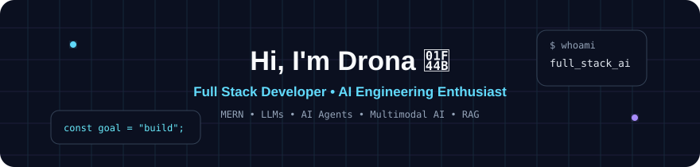

  

  

  
  
  
  
  
  

---

# Hi, I'm Drona 👋

### B.Tech CSE Graduate | MERN Stack Developer | AI Engineering Enthusiast

I'm a Computer Science graduate interested in building **full-stack applications and AI-powered systems**.

I started with web development and the MERN stack, building applications around practical problems. I'm now expanding into **AI Engineering, Generative AI, LLM applications, multimodal AI, and AI agents**.

My goal is to combine strong full-stack development with AI to build useful, production-oriented applications.

---

## 🚀 What I'm Building

### 🎨 MangaCraft

An **AI-powered workspace for manga creation**, evolving from a conversational assistant into a full-stack AI application.

Currently moving from the V2 AI-agent foundation toward a **multi-user, production-oriented architecture**, exploring:

`AI Agents` · `Tool Calling` · `Project Memory` · `Multimodal AI` · `RAG` · `Embeddings` · `Vector Search`

🔗 [GitHub Repository](https://github.com/Drona0113/Manga-Craft)

---

## 📌 Selected Projects

| Project                       | Description                                                                                                             | Links                                                                                                                                         |
| ----------------------------- | ----------------------------------------------------------------------------------------------------------------------- | --------------------------------------------------------------------------------------------------------------------------------------------- |
| 🛒 **AgriMart**               | Multi-role agricultural marketplace with authentication, RBAC, payments, multilingual support, and audit logging.       | [GitHub](https://github.com/Drona0113/AgriMart) · [Live Demo](https://agri-mart-orcin.vercel.app)                                             |
| 🏘️ **Grama Charithra**       | Digital archive for documenting and exploring the history and cultural heritage of villages in Andhra Pradesh.          | [GitHub](https://github.com/Drona0113/Gramacharitra-dyamic)                                                                                   |
| 📊 **Crime Count Prediction** | Machine-learning application using Support Vector Regression to predict crime counts and visualize the results.         | [GitHub](https://github.com/Drona0113/Crime-Count-Prediction-using-SVR) · [Live Demo](https://crime-count-prediction-using-svr.streamlit.app) |
| 🎨 **MangaCraft**             | AI manga assistant exploring project memory, AI agents, multimodal analysis, tool calling, and AI-generated references. | [GitHub](https://github.com/Drona0113/Manga-Craft)                                                                                            |

---

## 🛠️ Tech Stack

### Languages

`JavaScript` `Python` `Java`

### Frontend

`HTML` `CSS` `React.js` `Redux Toolkit`

### Backend & Databases

`Node.js` `Express.js` `MongoDB` `Mongoose` `SQLite` `REST APIs`

### AI & Generative AI

`LLMs` `Generative AI` `AI Agents` `Tool Calling` `Multimodal AI` `Prompt Engineering`

### Tools

`Git` `GitHub` `VS Code` `Postman`

---

## 🧠 DSA

Currently practicing **Data Structures & Algorithms in Java** using the **Striver A2Z DSA Course / Sheet by Take U Forward**.

---

## 📚 Currently Learning

I'm expanding my knowledge toward **AI Engineering and production full-stack development**.

- Data Structures & Algorithms in Java — Striver A2Z
- Python and its libraries
- AI Engineering
- LLM application development
- Generative AI
- AI Agents
- RAG
- Embeddings & Vector Databases
- Production backend architecture

---

## 🎯 Career Focus

I'm currently looking for **early-career software development opportunities**, particularly in:

`MERN Stack` · `Full-Stack Development` · `React` · `Node.js` · `Software Development`

At the same time, I'm building toward a long-term career in **AI Engineering**, combining full-stack development with AI systems.

---

## ⚡ Currently Building

### MangaCraft V2 → V3

Taking MangaCraft from its V2 AI-agent foundation toward a **production-oriented full-stack AI application**.

The next stage will explore:

`React` · `FastAPI` · `PostgreSQL` · `Authentication` · `RAG` · `Embeddings` · `Vector Search` · `Multi-user Architecture`

---

## 📊 GitHub Activity

  <picture>
    <source
      media="(prefers-color-scheme: dark)"
      srcset="./dist/github-snake-dark.svg"
    />
    <source
      media="(prefers-color-scheme: light)"
      srcset="./dist/github-snake.svg"
    />
    
  </picture>

---

## 🤝 Let's Connect

I'm interested in connecting with developers, engineers, and people building interesting products with web technologies and AI.

- 💼 LinkedIn: [kaja-drona-venkata-sai-gopinadh](https://www.linkedin.com/in/kaja-drona-venkata-sai-gopinadh-443986269/)
- 📧 Email: `drona8978@gmail.com`
- 💻 GitHub: [@Drona0113](https://github.com/Drona0113)

---

  <i>Building. Learning. Shipping. 🚀</i>

